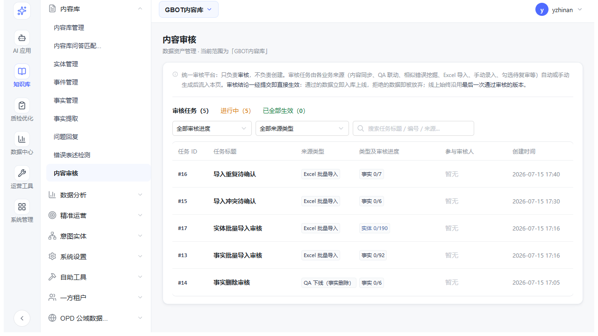
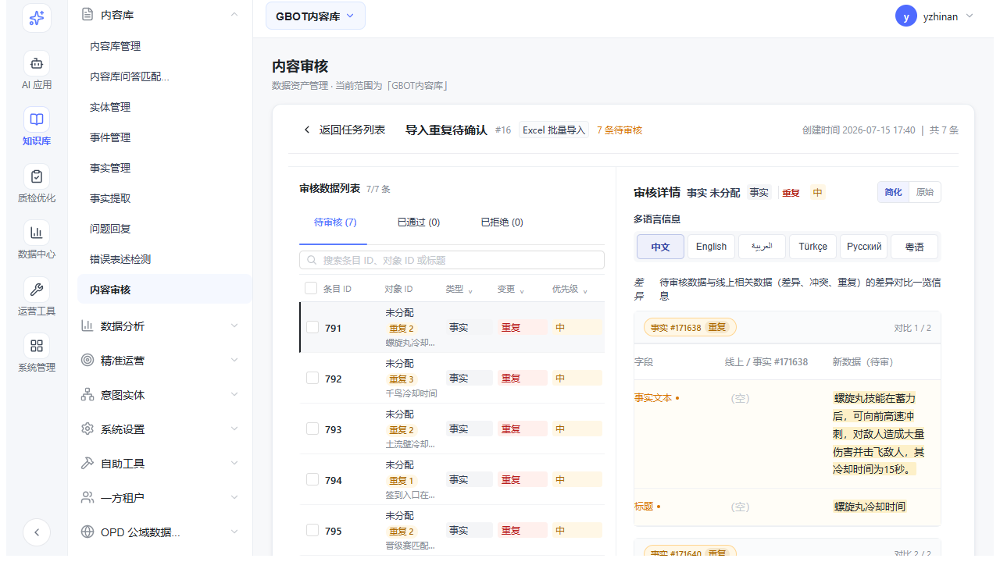
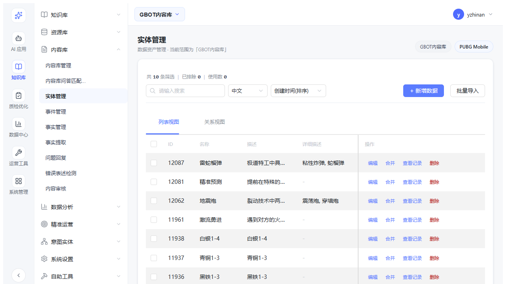
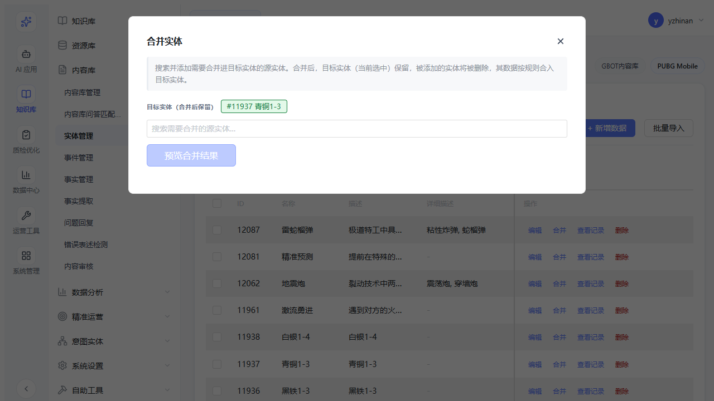
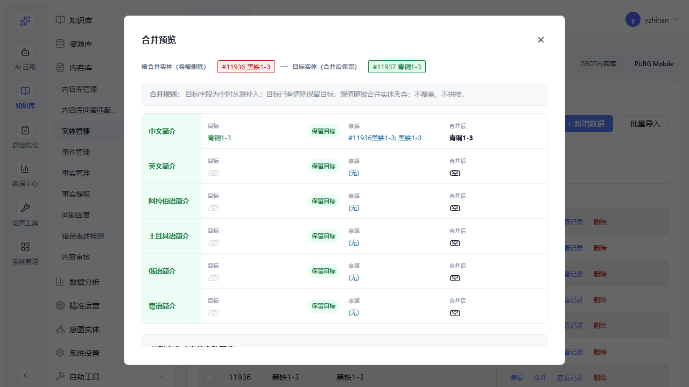
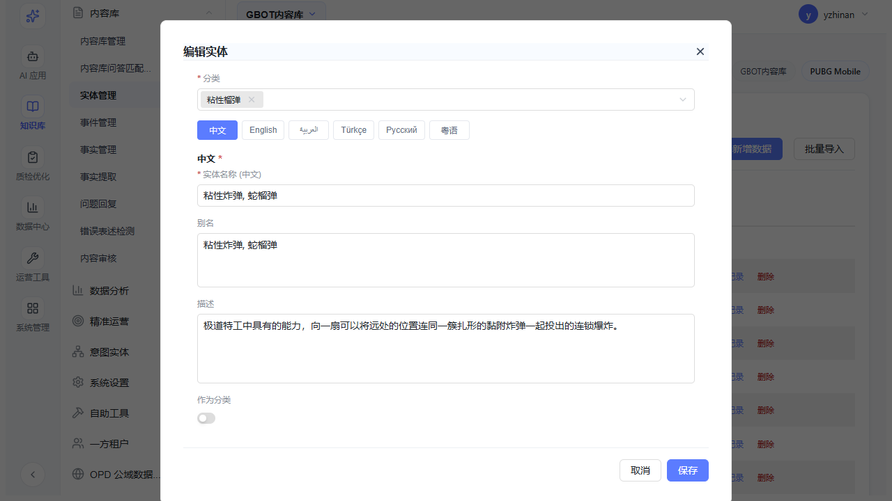
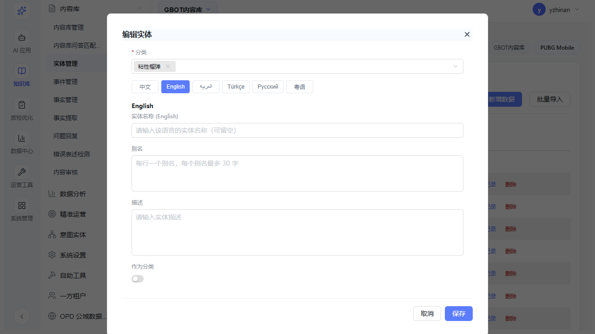
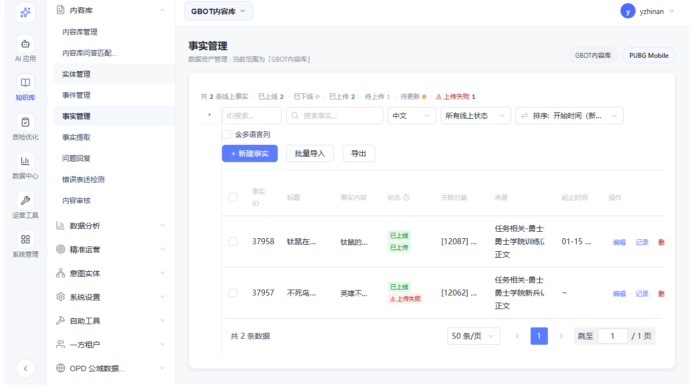

# Gbot 事实库管理平台 · 二期需求总结

> 文档版本：v1.1（2026-08-18）
> 汇总依据：`PRD-二期需求-父需求.md`、`PRD-二期-子1-内容同步审核.md`、`PRD-二期-子2-已入库内容改动审核.md`、`PRD-二期-子3-实体事实合并功能.md`、`PRD-内容同步审核流程.md`
> 实现依据：`需求细节变更记录.md`（2026-08-12 ~ 08-18 全部迭代记录）+ 当前原型实际实现
> 关联：一期已实现字段基础（review_status、upload_status、多语言 6 语种、parent_game_id 多游戏隔离等）
> 说明：各子需求均标注「实现现状（以原型为准）」，与 PRD 目标不一致处以原型为准

---

## 一、项目背景与目标

### 背景痛点
1. **内容同步无审核**：外部来源（QA/文档库）自动同步的内容直接入库，缺少质量把关
2. **已入库内容改动无审核**：编辑已入库事实后直接生效，无版本追溯和审核机制
3. **重复实体/事实无合并流程**：不同语言分组下可能存在重复实体，无合并入口
4. **冲突检测覆盖不全**：手动添加事实时无冲突/重复检测
5. **多语言添加体验差**：新增实体时切换语言会清空已填写内容
6. **误操作风险**：新建数据时点击空白处会意外关闭编辑内容

### 二期目标（7 项）

| # | 目标 | 优先级 | 实现状态 |
|---|---|---|---|
| 1 | 内容同步审核闭环 | P0 | ✅ 已实现（直接生效模式） |
| 2 | 已入库内容改动审核（版本对比） | P0 | ✅ 已实现（通过即生效）；回滚撤销待排期 |
| 3 | 实体/事实合并流程 | P0 | ✅ 已实现（实体独立合并窗口） |
| 4 | 手动添加事实冲突/重复检测 | P1 | ⏳ 未实现 |
| 5 | AI 差异识别（审核自动生成差异摘要） | P1 | ⏳ 未实现（原型以静态差异对比替代） |
| 6 | 新增实体多语言支持（一次性多语言添加） | P2 | ✅ 已实现（编辑窗口 6 语言 Tab，每语言名称/别名/描述） |
| 7 | 体验优化（防误触 + 冲突对比页优化） | P3 | 🟡 部分实现（差异对比页已高度优化；防误触未实现） |

---

## 二、子需求详述

### 子需求 1：内容同步审核功能（P0）

- **目标**：低置信度来源同步的数据必须经审核才能生效
- **来源置信度规则**：
  | 来源类型 | 置信度 | review_status |
  |---|---|---|
  | 手动模板导入 | 高 | ready（直接通过） |
  | Gbot_qa / QA 联动 | 高 | ready |
  | 文档库爬取 | 低 | pending_review（进审核池） |
  | 其他来源 | 低 | pending_review |
- **新增字段**：`source_confidence`（high/low）、`sync_batch_id`（同步批次 ID）
- **与子2的区别**：子1 覆盖「新增事实」审核（无版本对比）；子2 覆盖「覆盖更新」审核（有版本对比）

**实现现状（以原型为准）**：
- 「审核任务」Tab 已实现，任务制管理，按批次/来源聚合
- **审核直接生效模式**（2026-08-17 变更）：审一条通过一条立即生效，**无「应用结果」「归档」「撤销」步骤**
- 任务列表为计数条：「审核任务 N / 进行中 N（橙）/ 已全部生效 N（绿）」
- 任务操作列：进行中 =「进入审核」；已全部生效 =「查看结果 + 已全部生效」标记
- 支持搜索、筛选（审核进度：全部/含待审核/已全部处理）、分页、批量通过/拒绝（仅多选时显示）
- 详情内支持通过并新增 / 通过并覆盖 / 通过并删除 / 拒绝 / 编辑新数据

### 子需求 2：已入库内容改动审核（P0）

- **目标**：编辑已入库事实后不直接生效，支持版本对比
- **last_version 机制**（PRD 原设计）：
  - 编辑 ready 事实 → 旧版快照存入 `last_version`，当前内容更新为新版，review_status = pending_review
  - 连续编辑 → last_version 不覆盖，当前内容直接覆盖
  - 审核通过 → ready，last_version 保留备查
  - 审核拒绝 → 回滚为 last_version，恢复 ready，last_version 清空
- **AI 差异摘要**：审核抽屉打开时实时 LLM 生成，切换记录打断请求，失败兜底
- **版本对比高亮**：旧版红色删除线、新版黄色高亮；多语言按当前语言展示

**实现现状（以原型为准）**：
- **版本流转**：线上始终只有一个「生效版本」（liveVersion，即最后一次通过审核的版本）；待审版本均以它为基准做新旧对比。通过 → 待审值立即写入 liveVersion（快照时间更新为审核时间）；拒绝 → 放弃待审版本，线上不变
- **「撤销 + 版本快照 + 过期失效」机制**（2026-08-17 11:20 记录）：⏳ **仅记录需求，未实现，待排期**（任务生成时记录线上快照、跨版本待审过期失效、撤销回滚）
- **简化/原始双视图**：简化视图 = 差异字段扁平列表；原始视图 = 左右双泳道（「库内数据」/「新数据」）按编辑窗字段全量展示 + 来源信息
- **候选对比**：统一标签「对象类型 #ID + 类型（覆盖灰/冲突红/重复橙）+（+n）+ ▾」下拉切换；≥2 候选在简化视图并排 n 张对比卡片
- **字符级差异高亮**：旧值红色删除线、新值黄色高亮，相同部分不变色
- **多语言**：6 语言切换（zh/en/ar/tr/ru/zh-hk），阿拉伯语 RTL + 阿拉伯语标点（，；؟）；缺失语言标「该语言无数据」，删除标记 `محذوف`
- **冲突/重复标签统一红色**（2026-08-18 变更）：conflict / contradiction / duplicate 统一 `#b42318`，列表行冲突任务优先展示红色「冲突/重复」标签
- **跨任务 superseded**：同 factId 在较新任务已通过时，历史任务同对象条目标记「已在较新任务中处理」并锁定只读
- **字体制度**：标题 15 / 正文 13 / 辅助 12 / 微型 11；字重 400/500/600；灰阶 #1f2328/#344054/#8a9099/#c4c8ce；状态色绿 #15803d / 红 #b91c1c / 橙 #d97706 / 蓝 #4052c6

### 子需求 3：实体/事实合并功能（P0）

- **目标**：提供人工合并入口，处理重复实体/事实
- **合并执行**：被合并记录软删（deleted=true），其下事实迁移到主记录，关联引用同步更新，操作日志记录 merge
- **边界**：合并后发现合并错 → 二期不支持撤销，需人工从操作日志恢复
- **二期简化**：直接合并 + 记录，不走审核流程（如需审核三期再做）

**实现现状（以原型为准）**：
- **实体合并已实现为独立窗口**（不在编辑窗口内）：
  - 入口：实体管理列表操作列「合并」按钮（与编辑/查看记录/删除并列）
  - 流程：打开即选目标实体（操作列点击的那条，绿色「合并后保留」）→ 搜索添加被合并源实体（红色标签可移除）→ 「预览合并结果」→ 字段级合并预览 + 关联事实/事件变动预览 → 确认合并（含「被合并实体将被删除」警告）
  - 被合并实体可多选；排除目标实体自身与已选实体
- **字段级合并规则**（2026-08-18 变更）：
  - **目标字段为空、单源有值 → 填入源值；目标已有值 → 保留目标（源值随被合并实体丢弃，不覆盖不拼接）**
  - 多源同字段需用户下拉选择来源
  - **各语种独立取值，不跨语种填充**：中文取 `translations.zh.description`（缺失回落顶层 description）；其它语种仅取对应语种，缺失留空
- **关联数据变动预览**：扫描被合并实体挂载的事实（实体引用迁移 `[旧ID] → [目标ID]`）及牵连事件
- **确认弹窗**：列出合并变更清单（关联迁移/字段合并/引用更新/被合并实体删除），红底警告「此操作不可撤销」
- 事实合并：⏳ 未实现（当前仅实体合并）

### 子需求 4：手动添加事实冲突/重复检测（P1）

- PRD：手动添加事实时填写完必填字段后点击「检测冲突/重复」，复用 `check-contradiction` / `find-duplicates` 接口，确认无冲突才可提交
- **实现现状**：⏳ 未实现

### 子需求 5：AI 差异识别能力（P1）

- PRD：审核抽屉打开/内容变更时实时生成一句话差异摘要（LLM），打断逻辑，渐变蓝背景卡片
- **实现现状**：⏳ 未实现；原型以静态字段差异对比 + 字符级高亮替代（差异展示已完备，缺 LLM 摘要）

### 子需求 6：新增实体多语言支持（P2）

- PRD：语言选择改为多选（Checkbox 组），一次性创建多个语言版本；二期先支持实体
- **实现现状（以原型为准）**：
  - 实体编辑窗口语言切换改为 6 语言 Tab（中文/English/العربية/Türkçe/Русский/粤语）
  - **每个语言 Tab 下均为「实体名称 / 别名 / 描述」三件套**（2026-08-18 变更，替代原先仅中文名称）
  - 中文名称必填（校验失败自动切回中文 Tab）；其它语言可留空
  - 保存后各语言标题写入 `translations[lang].title`，`entity.title` 以中文为准
  - 新增实体的多语言多选一次性添加：⏳ 未实现（当前为编辑窗口内逐语言填写）

### 子需求 7：体验优化（P3）

- **冲突对比详情页优化**：✅ 已实现（字符级差异高亮、双泳道、候选标签、多语言、字体制度全站统一）
- **防误触**（新建/编辑数据点击空白处弹确认框 / Drawer 禁止 overlay 关闭）：⏳ 未实现
- **管理页体验优化（已实现）**：事实管理去左栏改顶部分类 chip、列精简省略号截断（2026-08-14）；三个管理页操作栏统一「编辑/查看记录/删除」（实体另加「合并」）；批量删除 + 「有待审版本」标签跨页联动审核

---

## 三、核心状态与数据模型

### review_status 状态枚举
| 状态 | 说明 | 线上是否召回 |
|---|---|---|
| pending_review | 待审核 | 否 |
| ready | 已审核通过/自动通过 | 是 |
| rejected | 审核拒绝（软删） | 否 |

### 任务状态（直接生效模式）
| 状态 | 说明 |
|---|---|
| reviewing | 审核中（有待审条目） |
| done | 已全部生效（全部条目已通过/拒绝） |

### 关键接口（待开发）
| 接口 | 用途 |
|---|---|
| POST /api/facts/sync | 来源同步入库（新增 review_status 判定） |
| GET /api/facts?review_status=pending_review | 查询待审核数据 |
| POST /api/facts/:id/review/approve | 单条通过 |
| POST /api/facts/:id/review/reject | 单条拒绝并删除 |
| POST /api/facts/batch_review/approve | 批量通过 |
| POST /api/facts/batch_review/reject | 批量拒绝并删除 |
| POST /api/ai/diff_summary | AI 差异摘要生成 |

---

## 四、验收要点速览（以当前实现为准）

| 子需求 | 核心验收项 | 状态 |
|---|---|---|
| 子1 | 任务计数条（审核任务/进行中/已全部生效）；进入审核；批量通过/拒绝（多选时）；通过即生效无应用/归档/撤销 | ✅ |
| 子2 | 线上唯一生效版本为对比基准；通过后立即写入 liveVersion；简化/原始双视图；候选统一标签+下拉切换；字符级高亮；6 语言+阿语 RTL；冲突/重复标签统一红色 #b42318；superseded 锁定 | ✅ |
| 子3 | 操作列「合并」→ 独立窗口；目标保留/源删除语义；字段级预览（保留目标/填入源值/多源选择）；各语种独立取值不填中文；关联事实/事件变动预览；确认弹窗含删除警告；合并后被合并实体从列表移除 | ✅（实体）/ ⏳（事实） |
| 子4 | 手动添加事实冲突/重复检测 | ⏳ |
| 子5 | AI 差异摘要（LLM） | ⏳ |
| 子6 | 编辑窗口 6 语言 Tab，每语言名称/别名/描述；中文必填；translations[lang].title 保存 | ✅ |
| 子7 | 差异对比页优化已实现；防误触 | 🟡 |

---

## 五、未实现项记录

以下为二期 PRD 范围内、已记录但当前原型未实现的内容（排期后续再定）：

| # | 需求 | 原优先级 | 来源 | 说明 |
|---|---|---|---|---|
| 1 | 手动添加事实冲突/重复检测（子4） | P1 | PRD-二期-子2 | 复用 check-contradiction / find-duplicates 接口，检测结果抽屉内展示，确认无冲突才可提交 |
| 2 | AI 差异摘要（子5） | P1 | PRD-二期-子2 | 审核抽屉打开/内容变更时 LLM 实时生成一句话差异摘要，需实现请求打断与失败兜底；当前原型以静态差异对比+字符级高亮替代 |
| 3 | 事实合并（子3 未完成部分） | P0 | PRD-二期-子3 | 实体合并已完成；事实合并流程（多选→选主记录→字段映射→执行→软删+迁移+日志）待实现 |
| 4 | 撤销 + 版本快照 + 过期失效（子2 扩展） | P0 | 需求细节变更记录 2026-08-17 11:20 | 任务生成时记录线上快照、跨版本待审条目过期失效、审核拒绝撤销回滚；当前为「通过即生效」直接模式 |
| 5 | 防误触（子7） | P3 | PRD-二期-父需求 | 新建/编辑数据点击空白处弹确认框，或 Drawer 禁止 overlay 关闭 |

## 六、文档目录索引

| 文档 | 说明 |
|---|---|
| `docs/PRD-二期需求-父需求.md` | 二期总览：背景、目标、7 个子需求总览 |
| `docs/PRD-二期-子1-内容同步审核.md` | 子需求1 详细设计 |
| `docs/PRD-二期-子2-已入库内容改动审核.md` | 子需求2 详细设计 |
| `docs/PRD-二期-子3-实体事实合并功能.md` | 子需求3 详细设计 |
| `docs/PRD-内容同步审核流程.md` | 内容同步审核流程（草稿版，覆盖更新、批量审核、权限、接口） |
| `需求细节变更记录.md` | 每次需求变更的原始描述、实现方案、验收结果（2026-08-12 起） |
| `docs/二期-需求总结.md` | 本文档：需求总览 + 实现现状对齐 |

### 截图索引（`docs/images/`）
| 截图 | 内容 | 对应 |
|---|---|---|
| `01-entity-list.png` | 实体管理列表（操作列：编辑/合并/查看记录/删除） | 子3 |
| `02-merge-dialog.png` | 合并窗口（目标实体 + 搜索添加源实体） | 子3 |
| `03-merge-preview.png` | 合并预览（字段级来源 + 关联事实/事件变动） | 子3 |
| `04-review-list.png` | 审核任务列表（计数条、任务操作） | 子1 |
| `05-review-detail.png` | 审核详情工作区（双视图、候选标签、多语言） | 子2 |
| `06-entity-edit-dialog.png` | 实体编辑窗口（中文 Tab） | 子6 |
| `06b-entity-edit-en.png` | 实体编辑窗口（English Tab） | 子6 |
| `07-fact-list.png` | 事实管理页（分类 chip、精简列） | 子7 |
